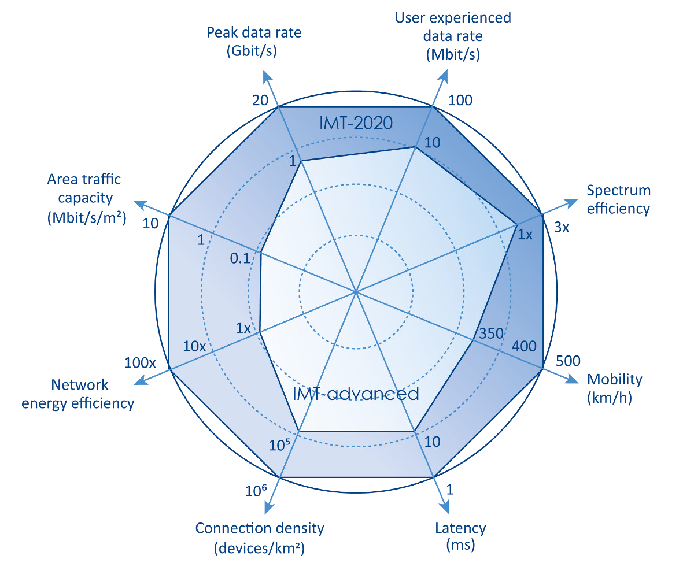
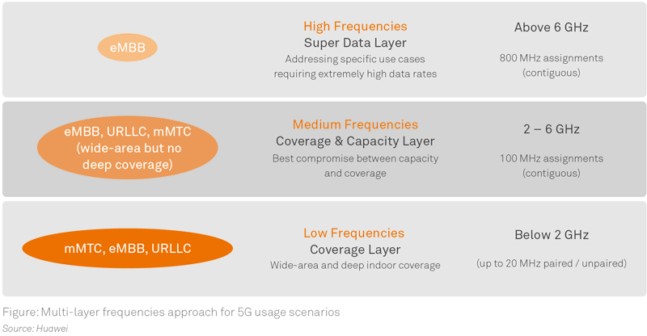

# Topics
1. 5G Introduction
2. 5G System Design 
3. Sofwarization 
4. 5G MEC
5. 5G RAT
6. 5G Enablers 
7. 5G Air Interface
8. 5G Network Security 
9. 5G Application and Use Cases
11. 5G Network Slicing
12. 5G Protocols
13. 5G Deployment & Transport 
14. 5G D2D
15. 5G M2M
16. 5G Frequency Bands

# 1. 5G Intro
## 1.1. 5GPPP & NGMN 
* 5GPPP : 5G public private partnership project 
    > * Joint colab between European Communication & European ICT Industry 
    > * ICT industry includes : ICT Manufacturers, Telcom operators, ISP, SME & Research Institute 
    > * 21 project lauched in June2017 at Brussel 
    > * 1000 times higher wireless area coverage 
    > * saves 90% energy/SP 
    > * Service creation time from 90 Hrs to 90 mins 
    > * Denser deployment
* NGMN : Next Gen Mobile Network 
    > * industry organization of world wide telco operators, vendors, R&D 
    > * Founded by INO at 2006
    > 
### Demands 
* High level E2E architecture (Software & Hardware)
    * netive support of SDN & NFV 
    * Network slicing : SGi Interface (4G), Service Driven slicing (uRLLC, mMTC, eMBB, IoT)
    
## Design Objective 
### Solution to Current crowded spectrum
* 5G demand high frequency, ultra dense network.
* Use of large portion of free spectrum bands (BW & Prpagation condition)
* Spectrum sharing techniques are introduced (SDN & NFV for monitoring)
* Highly efficient transmission and data processing techniques (Function must be introduced under Radio
protocol stack)
* Placing network function closer to the user (MEC)
* Seperate User and control plane (SDN), redefine the network boundary (Core & edge)
* change in architecture introduces new overhead such as interfaces, services etc. (challenge)
* Multi-Connectivity K
### Self Backhauling
* Device can act as BS and self eshtablish wireless backhaul link 
* Same network to provide fixed and mobile 
* Seperation and prioritization of equipment 
* Specialised device and Visualisation

## ITU-R IMT 2020 5G Vision 
1. Enhanced mobile broadband (eMBB)
2. Massive Machine type Communication (mMTC)
3. Ultra reliable Low Latency Communication (URLLC)

Spider chart of IMT 2020 [https://www.etsi.org/technologies/5g]

## Spectrum Requirements 
5G requires High, Med & Low frequencies to cater various types of application 
* Low Freq  : Below 2 GHz : 700 MHz  
* Mid Freq  : (2 - 6 GHz)  : 3300 - 3800 MHz 
* High Freq : Above 6 GHz : 24.25 - 29.5 , 37 - 43.5 GHz

[https://www.huawei.com/nz/about-huawei/public-policy/5g-spectrum/spectrum-requirements-across-multiple-layers
]
## Globally Harmonised 5G Spectrum 
* Spectrum should be allocated on primary / Co-primary basis, Globally or Regionally 
* Consistent Frequency Assignments including all Band plans and duplex mode,  market adaptibility
* Harmonised stadard : Same technology standard is to be adapted (ITU-R & NR is standardising)
* C -Band : 3300 - 4200 MHz, 4400 - 5000 MHz 
    * 3400 - 3600 MHz for Co-primary mobile 
    * 3300 - 3800 MHz : TDD - commercially ready by 2018
* WRC-15 introducec various working groups (units in GHz)
    * Group 30 : 24.25 - 27.5 , 31.8 - 33.4 
    * Group 40 : 37 - 40.5 , 40.5 - 42.5 , 42.5 - 43.5 
    * Group 50 : 45.5 - 47, 47 - 47.2, 47.2 - 50.2, 50.4 - 52.6
    * Group 70/80 : 66 - 71 , 71 - 76, 81 - 86 
    * 27.5 - 29.5 : Not under WRC : 5G, South Korea & Japan 
    * 24.25 - 29.5 , 37 - 43.5 : Early deployment for mmWave 

## Industry Progress 
### Europe 
* 2018 - 19 : Trail 
* 3.4 - 3.8 GHz eMBB, IoT
### USA
* 2017 - 2018 : Trial 
* 28, 39 GHz : Fixed wire access & eMBB
### China
* 2019 : Commercial 
* 3.4 - 3.6 GHz, 4.8 - 5 GHz : Uplink sharing (2Ghz Sub-carrier), eMBB, NB-IoT
### Korea 
* 2019 : Commercial 
* 28 GHz, 3.4 - 3.7 GHz : eMBB
### Japan
* 2020 : Commercial 
* 3.6 - 4.2, 4.4 - 4.9, 28 GHz : eMBB

## 5G Network Prospect
7 prospect of 5G Network 
1. Energy efficient 
2. To break the boundary of conventional cells (introductions of HetNets, UDNs)
   > "No more cells" (NMC) or "User centric cells" (UCC)
3. Signalling and Control : Context aware and Service oriented 
4. Low cost Antenna : "Invisible BS", Ultra dense. (Massive MIMO)
    > Active antenna array 
5. Spectrum & Air Interface : Traditional (One size fits all), in 5G (Software defined air interface -
SDAI). 
    >* energy efficient co-optimiztion 
    >*  Frame Struc, Wave form, Modulation and Coding scheme etc
6. Fraunhaul : CRAN + Massive MIMO
7. Protocols : UE and Cell as separate entity 

### User Centric Network 
User centric than cell centric by supporting 7 features  
