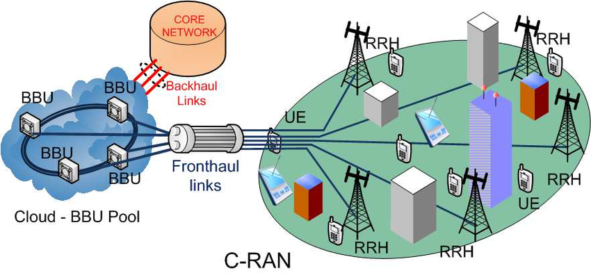

- [Topics](#topics)
- [1. 5G Intro](#1-5g-intro)
  * [1.1. 5GPPP & NGMN](#11-5gppp---ngmn)
    + [Demands](#demands)
  * [Design Objective](#design-objective)
    + [Solution to Current crowded spectrum](#solution-to-current-crowded-spectrum)
    + [Self Backhauling](#self-backhauling)
  * [ITU-R IMT 2020 5G Vision](#itu-r-imt-2020-5g-vision)
  * [Spectrum Requirements](#spectrum-requirements)
  * [Globally Harmonised 5G Spectrum](#globally-harmonised-5g-spectrum)
  * [Industry Progress](#industry-progress)
    + [Europe](#europe)
    + [USA](#usa)
    + [China](#china)
    + [Korea](#korea)
    + [Japan](#japan)
  * [5G Network Prospect](#5g-network-prospect)
    + [User Centric Network](#user-centric-network)
- [2. 5G Design Architecture](#2-5g-design-architecture)
  * [2.1. 5G Scenario](#21-5g-scenario)
  * [2.2. 5G RAN](#22-5g-ran)
  * [2.3 5G Mobile Core](#23-5g-mobile-core)
  * [2.4. RRH (Remote Radio Head)](#24-rrh--remote-radio-head-)
    + [RRH Contains](#rrh-contains)
    + [Functions of RRH](#functions-of-rrh)

<small><i><a href='http://ecotrust-canada.github.io/markdown-toc/'>Table of contents generated with markdown-toc</a></i></small>

# Topics
1. 5G Introduction
2. 5G System Design 
3. Sofwarization 
4. 5G MEC
5. 5G RAT
6. 5G Enablers 
7. 5G Air Interface
8. 5G Network Security 
9. 5G Application and Use Cases
11. 5G Network Slicing
12. 5G Protocols
13. 5G Deployment & Transport 
14. 5G D2D
15. 5G M2M
16. 5G Frequency Bands

# 1. 5G Intro
## 1.1. 5GPPP & NGMN 
* __5GPPP__ : 5G public private partnership project 
    > * Joint colab between European Communication & European ICT Industry 
    > * ICT industry includes : ICT Manufacturers, Telcom operators, ISP, SME & Research Institute 
    > * 21 project lauched in June2017 at Brussel 
    > * 1000 times higher wireless area coverage 
    > * saves 90% energy/SP 
    > * Service creation time from 90 Hrs to 90 mins 
    > * Denser deployment
* __NGMN__ : Next Gen Mobile Network 
    > * industry organization of world wide telco operators, vendors, R&D 
    > * Founded by INO at 2006
    > 
### Demands 
* High level E2E architecture (Software & Hardware)
    * netive support of SDN & NFV 
    * Network slicing : SGi Interface (4G), Service Driven slicing (uRLLC, mMTC, eMBB, IoT)
    
## Design Objective 
### Solution to Current crowded spectrum
* 5G demand high frequency, ultra dense network.
* Use of large portion of free spectrum bands (BW & Prpagation condition)
* Spectrum sharing techniques are introduced (SDN & NFV for monitoring)
* Highly efficient transmission and data processing techniques (Function must be introduced under Radio
protocol stack)
* Placing network function closer to the user (MEC)
* Seperate User and control plane (SDN), redefine the network boundary (Core & edge)
* change in architecture introduces new overhead such as interfaces, services etc. (challenge)
* Multi-Connectivity K
### Self Backhauling
* Device can act as BS and self eshtablish wireless backhaul link 
* Same network to provide fixed and mobile 
* Seperation and prioritization of equipment 
* Specialised device and Visualisation

## ITU-R IMT 2020 5G Vision 
1. Enhanced mobile broadband (eMBB)
2. Massive Machine type Communication (mMTC)
3. Ultra reliable Low Latency Communication (URLLC)

Spider chart of IMT 2020 [https://www.etsi.org/technologies/5g]

## Spectrum Requirements 
5G requires High, Med & Low frequencies to cater various types of application 
* __Low Freq__  : Below 2 GHz : 700 MHz  
* __Mid Freq__  : (2 - 6 GHz)  : 3300 - 3800 MHz 
* __High Freq__ : Above 6 GHz : 24.25 - 29.5 , 37 - 43.5 GHz

[https://www.huawei.com/nz/about-huawei/public-policy/5g-spectrum/spectrum-requirements-across-multiple-layers
]
## Globally Harmonised 5G Spectrum 
* Spectrum should be allocated on primary / Co-primary basis, Globally or Regionally 
* Consistent Frequency Assignments including all Band plans and duplex mode,  market adaptibility
* Harmonised stadard : Same technology standard is to be adapted (ITU-R & NR is standardising)
* C -Band : 3300 - 4200 MHz, 4400 - 5000 MHz 
    * 3400 - 3600 MHz for Co-primary mobile 
    * 3300 - 3800 MHz : TDD - commercially ready by 2018
* WRC-15 introducec various working groups (units in GHz)
    * Group 30 : 24.25 - 27.5 , 31.8 - 33.4 
    * Group 40 : 37 - 40.5 , 40.5 - 42.5 , 42.5 - 43.5 
    * Group 50 : 45.5 - 47, 47 - 47.2, 47.2 - 50.2, 50.4 - 52.6
    * Group 70/80 : 66 - 71 , 71 - 76, 81 - 86 
    * 27.5 - 29.5 : Not under WRC : 5G, South Korea & Japan 
    * 24.25 - 29.5 , 37 - 43.5 : Early deployment for mmWave 

## Industry Progress 
### Europe 
* 2018 - 19 : Trail 
* 3.4 - 3.8 GHz eMBB, IoT
### USA
* 2017 - 2018 : Trial 
* 28, 39 GHz : Fixed wire access & eMBB
### China
* 2019 : Commercial 
* 3.4 - 3.6 GHz, 4.8 - 5 GHz : Uplink sharing (2Ghz Sub-carrier), eMBB, NB-IoT
### Korea 
* 2019 : Commercial 
* 28 GHz, 3.4 - 3.7 GHz : eMBB
### Japan
* 2020 : Commercial 
* 3.6 - 4.2, 4.4 - 4.9, 28 GHz : eMBB

## 5G Network Prospect
7 prospect of 5G Network 
1. Energy efficient 
2. To break the boundary of conventional cells (introductions of HetNets, UDNs)
   > "No more cells" (NMC) or "User centric cells" (UCC)
3. Signalling and Control : Context aware and Service oriented 
4. Low cost Antenna : "Invisible BS", Ultra dense. (Massive MIMO)
    > Active antenna array 
5. Spectrum & Air Interface : Traditional (One size fits all), in 5G (Software defined air interface -
SDAI). 
    >* energy efficient co-optimiztion 
    >*  Frame Struc, Wave form, Modulation and Coding scheme etc
6. Fraunhaul : CRAN + Massive MIMO
7. Protocols : UE and Cell as separate entity 

### User Centric Network 
User centric than cell centric by supporting 7 features  

# 2. 5G Design Architecture 

## 2.1. 5G Scenario 

[www.ericsson.com/en/mobility-report/future-mobile-data-usage-and-traffic-growth]
* Enhanced Telecom Infrastructure and New Services 
* Application areas 
    * Agriculture
    * Medicine 
    * Finance 
    * Transportation 
    * Manufacturing 
    * Education 
* 3 5G categaroy of service by ITU
    * mMTC : scalable monitoring and automation 
    * URLLC : tactile internent  
    * eMBB : Increase target bits/user 

## 2.2. 5G RAN 

[https://www.researchgate.net/figure/Cloud-RAN-architecture_fig1_282266765]

## 2.3 5G Mobile Core 

## 2.4. RRH (Remote Radio Head)

### RRH Contains
* BS RF Circuit 
* AD/DA Converter 
* Mixer 
* up/down power converter 

### Functions of RRH
1. Converts optical signal to electrical signal and vice versa using CPRI (Common Public
Radio Interface)
2. Tx Section converts Digital signal to RF, Amplify the signal to its desided power level and radiate 
2. Rx section receives signal at desired power state, di-ampligy and converts to digital signal 

[www.techplayon.com/rrh-remote-radio-head-connected-bbu-base-band-unit/]

## 2.5. 5G Architecture 
### impact of 5G in various networks 
1. Mobile network
2. Physical Networking & Computing facilities 
3. Service Infrastructure management and orchestration
4. Hosting and deployment system

### Features
1. E2E connection and compute infrastructures 
2. Application and service aware 
3. Evolution in terms of - Capacity, Performance and Spectrum Access 
4. Front-haul and back-haul integration 
5. Access, Aggregation and Core network 
6. SDN, MEC, IoT 
   
### Use Cases for 5G Business Opportunities
1. Implementing network slicing in a cost effective way 
2. addressing both end user and operational services
3. Supporting softawization natively  
4. Integrating Communication and Computation 
5. Integrating Het-Net technologies including fixed and wireless 

[https://5g-ppp.eu/wp-content/uploads/2014/02/5G-PPP-5G-Architecture-WP-July-2016.pdf]

##2.6. Network Slicing 

* Addresses the deployment of multiple logical networks (5G Slice) as a business operation 
on a common physical infrastructure. 
* a __5G Slice__ is a collection of 5G network function and Specific RAT settings, used for 
specific use-case and/or business model 
* A slice and be accommodated on Physical (PNF) or Virtual (VNF) network function 
* Must support both Centralised and Edge cloud 

### Convergence architecture (4G - 5G)

## 5G Architecture 
* Based on ETSI-NFV principles 
* E2E service management and orchestration (MANO) module
* Programmable controller for VNF/PNF 

[https://www.researchgate.net/publication/314493826_RAN_Architecture_Components_-_Intermediate_Report]
* separation of Control & Data plane using SDN 
* Isolation of Core (EPC) and Radio network (RAN) using a __Transport Network__ (supports slicing)
* Three new packet based interface are introduced 
    > 1. Packetised CPRI 
    > 2. Next Gen fronthaul Interface ( a new functional split within RAN) 
    > 3. New Backhaul Interface 
* optical networks to glue this modules 

### Logical & Functional architecture of 5G 
New network functions
* Filtering and forwarding 
* Deep packet inspection 
* Stream handling and signal processing 
* Web services and database functions 
* virtualization(including VNF) : represented by virtual machine (Reusable Function blocks : __RFB__)
    > Router, Firewall, NAT etc 

### Dynamic CRAN 
split of BB processing there are two options 
* __DRAN__ : Distributed RAN : Low latency 
* __CRAN__ : Cloud RAN : High spectral efficiency, high energy efficiency and reduce cost 

To bridge the gab between __DRAN__ and __CRAN__ Dynamic CRAN is introduced with the use of SDN and Visualization.
* Splits the BBU into PNF and VNF.
* VNF can move between various host based on network requirement 

 